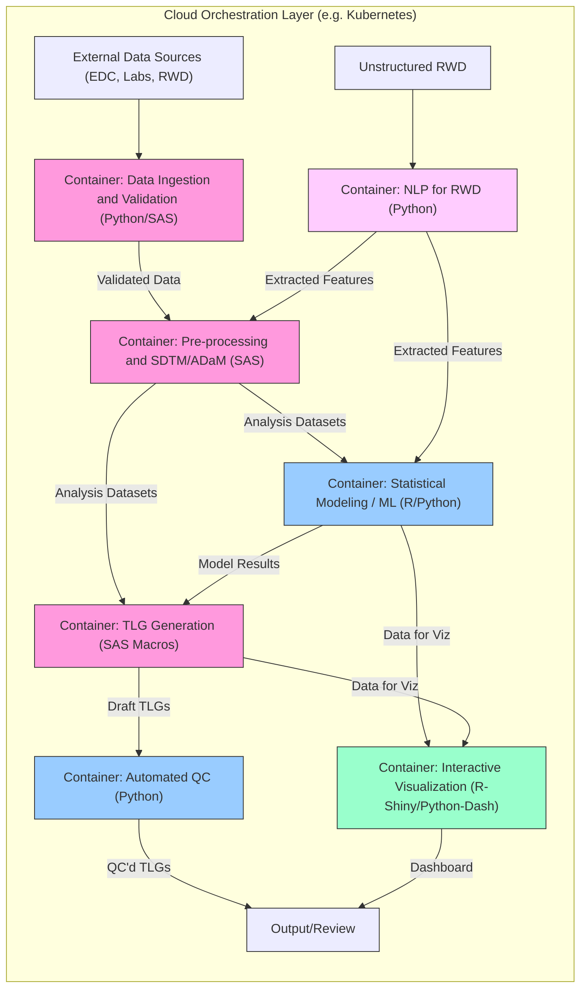

## 临床数据流程云编排架构图

## 架构解读

### 核心处理模块
🔷 **SAS核心组件（粉色）**：
- 数据摄取验证：支持Python/SAS混合编程
- 标准化处理：完成SDTM/ADaM转换
- TLG生成：基于SAS宏的报表自动化

🔵 **开源组件（蓝色）**：
- 机器学习建模：R/Python双引擎支持
- 自动化质控：Python实现的智能检查逻辑
- 交互可视化：Shiny/Dash双技术栈

🟣 **NLP专用容器（紫色）**：
- 处理非结构化真实世界数据(RWD)
- 特征提取支持预处理和建模环节
- 基于Python的NLP技术栈

### 数据流向
1. **主干流程**：  
   数据摄取 → 标准化处理 → 建模分析 → 报表生成 → 质控 → 终输出

2. **并行支线**：
   - 非结构化数据通过NLP容器处理
   - 可视化数据双向来源于建模和报表环节

3. **外部对接**：
   - 结构化数据源：EDC系统、实验室数据
   - 非结构化数据源：真实世界数据(RWD)

### 颜色标识
| 颜色       | 代表类型                 |
|------------|-------------------------|
| 粉色       | SAS核心处理模块         |
| 蓝色       | 开源技术组件            |
| 紫色       | NLP专用处理             |
| 浅灰色     | 外部数据源              |
| 米色       | 最终输出/用户界面       |

### 云原生特性
☁️ **Kubernetes编排优势**：
- 容器化隔离不同技术栈组件
- 动态扩展计算密集型任务（如NLP处理）
- 实现各环节的版本控制与回滚

⚙️ **流程自动化**：
- 端到端自动化数据流水线
- 内置质量门禁检查点
- 支持临床研究21 CFR Part 11合规要求

> 该架构特点：  
> - 传统SAS流程与AI技术的深度融合  
> - 结构化与非结构化数据的协同处理  
> - 满足临床研究全流程的自动化需求  
> - 云原生架构带来的弹性计算能力