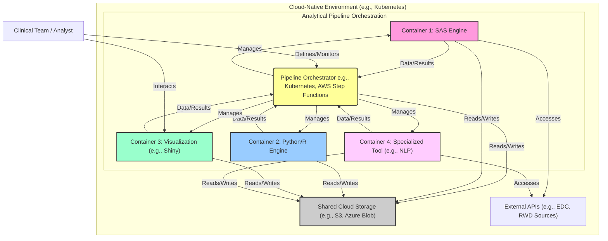

## 云原生分析流水线架构图

## 架构解读

### 云原生环境（Kubernetes集群）
1. **水平布局**：采用`direction LR`实现容器间的水平排列
2. **弹性架构**：基于容器技术实现计算资源的动态伸缩
3. **混合计算**：集成SAS与开源分析引擎（Python/R）

### 流水线编排核心
🟡 **编排中枢**：
- 支持Kubernetes/AWS Step Functions等多种编排工具
- 统一管理4类容器的生命周期
- 协调各环节数据/结果的传递顺序

📦 **容器矩阵**：
| 容器类型 | 颜色 | 功能特点 |
|---------|------|---------|
| SAS引擎 | 粉色 | 传统统计分析能力 |
| Python/R引擎 | 蓝色 | 机器学习/深度学习 |
| 可视化容器 | 浅绿 | 交互式结果展示（如Shiny） |
| 专用工具容器 | 紫红 | 领域专用分析（如NLP） |

### 数据基础设施
☁️ **共享存储**：
- 支持S3/Azure Blob等云存储服务
- 实现跨容器数据持久化
- 确保分析过程可复现

🌐 **外部API**：
- 对接EDC（电子数据采集系统）
- 集成RWD（真实世界数据源）
- SAS引擎和专用工具容器可直接调用

### 用户交互
👩💻 **临床团队**：
1. 通过可视化容器进行结果探索
2. 定义分析流水线参数配置
3. 实时监控整个分析流程执行

> 该架构实现了：  
> - 混合分析技术的容器化部署  
> - 复杂流水线的可视化编排  
> - 临床研究数据的端到端处理  
> - 云原生资源的弹性调度