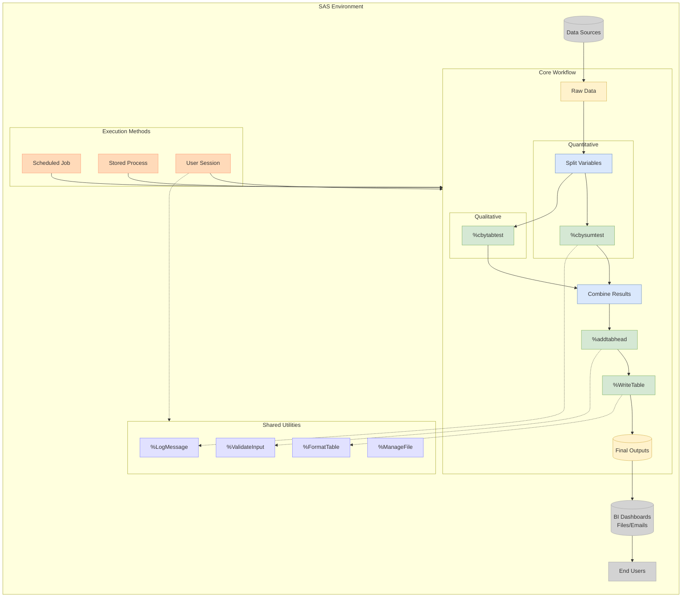

# 集成方案——模块化宏系统

## 结构解读

### 颜色编码体系
- 🟢 宏模块（Macro）：绿色背景，用于核心业务逻辑
- 🔵 处理过程（Process）：蓝色背景，表示数据处理步骤
- 🟡 数据节点（Data）：黄色背景，标识数据输入输出
- 🟣 工具组件（Utility）：紫色背景，共享功能模块
- 🟠 集成方式（Integration）：橙色背景，系统执行方法
- ⚪ 数据端点（Sources）：灰色背景，数据源与交付目标

### 核心工作流（CORE）
1. **数据接入**：原始数据通过Split Variables进行变量拆分
2. **双路径分析**：
   - 定量分析：调用%cbysumtest宏进行汇总检验
   - 定性分析：使用%cbytabtest宏进行频数检验
3. **结果整合**：合并分析结果后，通过%addtabhead添加表头
4. **输出生成**：最终由%WriteTable宏生成标准化输出表格

### 共享工具集（UTIL）
- **运行监控**：%LogMessage实现日志记录
- **质量保障**：%ValidateInput进行输入校验
- **文件管理**：%ManageFile处理文件操作
- **格式控制**：%FormatTable统一输出格式

### 执行体系（RUN）
- **定时任务**：Batch模式实现自动化运行
- **Web服务**：通过Stored Process提供API接入
- **交互分析**：支持用户直接调用分析流程

### 数据流向
原始数据经过核心工作流处理后，最终输出到看板、文件等交付渠道，最终服务于终端用户。虚线表示功能依赖关系，实线表示数据流动路径。

> 该架构通过模块化设计实现高复用性，各功能单元可独立维护升级，同时通过标准化接口保持系统整体协调运作。