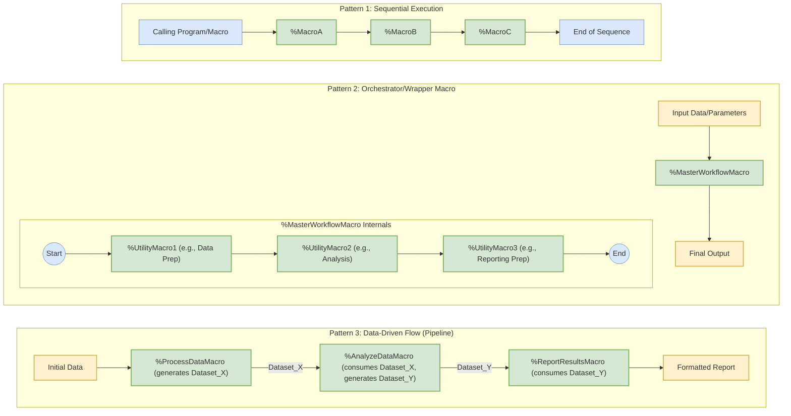

# 宏组合与编排方式

## 模式解读

### Pattern 1: 顺序执行（Sequential Execution）
- **结构特征**：通过直线型流程依次调用宏（%MacroA → %MacroB → %MacroC）
- **适用场景**：简单任务链，后一个宏依赖前一个宏的完整执行
- **可视化提示**：
  - 绿色框（macro类）表示宏单元
  - 蓝色端点（flow类）标记流程起点/终点
  - 无中间数据传递标记

### Pattern 2: 编排器/包装宏（Orchestrator/Wrapper Macro）
- **核心机制**：通过主控宏（%MasterWorkflowMacro）封装多个子宏的执行流程
- **实现特点**：
  - 输入参数统一由编排器接收
  - 内部隐藏子宏（%UtilityMacro1~3）的执行细节
  - 对外呈现为"黑盒"操作
- **优势**：提高代码复用性，简化主程序调用复杂度

### Pattern 3: 数据驱动流（Data-Driven Pipeline）
- **流程特征**：显式标注数据产物（Dataset_X/Y）的生成与消费关系
- **关键要素**：
  - 黄色数据节点（data类）表示输入/输出
  - 箭头标注具体传递的数据集
  - 每个宏明确标注数据处理角色（生成/消费）
- **适用场景**：需要跟踪数据关系的复杂处理流程

## 样式说明
| 样式类别     | 颜色特征                 | 应用元素               |
|--------------|--------------------------|------------------------|
| macro        | 浅绿色填充+绿边         | 所有宏单元             |
| data         | 浅黄色填充+金边         | 输入/输出数据节点      |
| flow         | 浅蓝色填充+蓝边         | 流程起点/终点标记      |