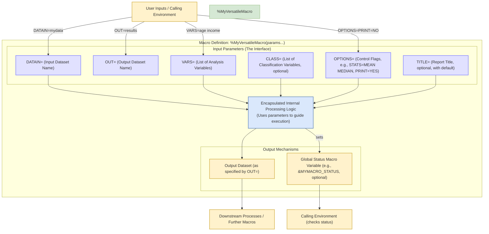

# 宏参数——接口设计

## 接口设计流程图解

## 结构解读

### 结构组成
1. **用户输入**（浅黄色区块）
   - 调用环境通过具体参数值驱动宏的执行
   - 示例参数传递：`DATAIN=mydata`, `OUT=results` 等

2. **接口参数**（紫色边框区块）
   - `DATAIN=`：指定输入数据集名称（必选）
   - `OUT=`：定义输出数据集名称（必选） 
   - `VARS=`：分析变量列表（必选）
   - `CLASS=`：分类变量（可选）
   - `OPTIONS=`：控制开关（如 `STATS=MEAN` 指定统计量，`PRINT=NO` 关闭打印）
   - `TITLE=`：报表标题（可选，含默认值）

3. **核心逻辑**（蓝色区块）
   - 封装数据处理逻辑，根据参数组合动态调整执行流程
   - 支持参数缺失时的默认值处理机制

4. **输出机制**（浅黄色区块）
   - 生成指定格式的输出数据集
   - 通过全局宏变量（如 `&MYMACRO_STATUS`）返回执行状态码

### 设计特点
- **参数隔离**：通过明确定义的接口参数隔离调用环境与内部实现
- **可扩展性**：`OPTIONS` 参数支持通过键值对灵活扩展功能
- **状态反馈**：状态变量使调用环境可以检测宏执行结果
- **管道式设计**：输出数据集可直接作为下游程序的输入

### 典型调用流程
1. 用户传入具体参数值
2. 宏通过接口参数接收输入
3. 内部逻辑根据参数组合执行计算
4. 生成数据集和状态变量
5. 下游程序消费输出结果