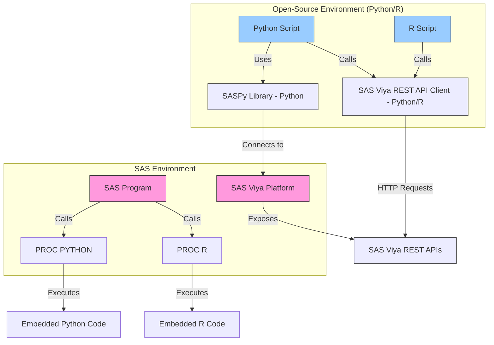

## SAS与开源环境集成架构图

## 架构 SAS SAS环境（粉色区块）
1. **SAS程序**：通过`PROC PYTHON`和`PROC R`过程步直接调用Python/R代码
2. **SAS Viya平台**：提供核心计算能力，暴露REST API接口
3. **嵌入式执行**：支持在SAS程序中直接嵌入Python/R代码段

### 开源环境（蓝色区块）
1. **Python/R脚本**：独立运行的开放源代码
2. **SASPy库**：Python专用库，提供与SAS的本地化连接
3. **Viya API客户端**：支持Python/R通过REST API与SAS Viya交互

### 连接方式
- 🟢 **直接连接**：通过SASPy库建立Python到SAS Viya的直接通道
- 🌐 **API调用**：使用HTTP协议访问SAS Viya REST API接口
- 🔄 **双向集成**：既支持SAS调用开源代码，也支持外部程序调用SAS服务

### 颜色标识
- 粉色：SAS原生组件
- 蓝色：开源环境元素
- 浅绿：连接适配器
- 橙色：API接口层

> 该架构实现了SAS与开源生态系统的深度融合，支持：  
> - 在SAS环境中直接执行Python/R代码  
> - 使用Python/R开发独立的SAS应用  
> - 通过标准化API进行跨平台集成
