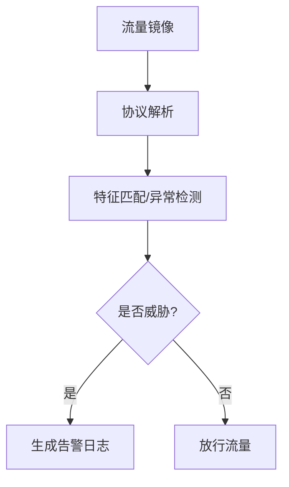
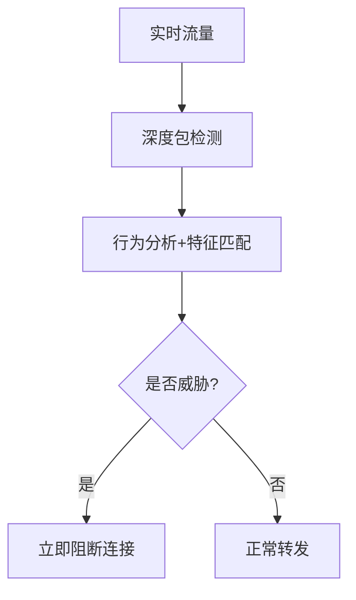

# 入侵检测系统（IDS）与入侵防御系统（IPS）对比

## 一、基本定义

### 1. IDS（入侵检测系统）

-   **定位**：网络安全监控设备
-   **核心功能**：检测系统内部异常行为，以旁路方式监控网络流量、系统日志、进程和内存指标
-   **检测范围**：已发生的攻击行为或异常事件

### 2. IPS（入侵防御系统）

-   **定位**：主动防御型网络边界设备
-   **核心功能**：实时阻断恶意流量，部署于防火墙与内部网络之间
-   **检测范围**：潜在攻击行为和异常流量

------------------------------------------------------------------------

## 二、核心区别对比

| 对比维度     | IDS                        | IPS                          |
|--------------|----------------------------|------------------------------|
| **工作模式** | 被动检测                   | 主动防御                     |
| **部署方式** | 旁路监听（不影响网络流量） | 串联接入（直接处理流量）     |
| **响应机制** | 事后告警                   | 实时阻断                     |
| **防护层级** | 应用层检测                 | 网络层+应用层深度防御        |
| **性能影响** | 较低                       | 较高                         |
| **误报处理** | 仅基于签名的告警           | 需平衡阻断准确性与业务连续性 |
| **协议支持** | 无法有效处理加密/UDP流量   | 可阻断UDP会话                |

------------------------------------------------------------------------

## 三、工作机制详解

### 1. IDS工作流程

### 2. IPS工作流程

------------------------------------------------------------------------

## 四、部署位置对比

### 1. IDS典型部署场景

-   **核心位置**：
    -   服务器区域交换机
    -   Internet接入路由器后的首台交换机
    -   重点保护网段交换节点
-   **部署原则**：
    -   覆盖所有关键业务流量
    -   支持分布式部署架构

### 2. IPS关键部署区域

-   **必选区域**：
    -   网络边界出入口（防火墙后）
    -   核心服务器前端
    -   内部网络接入层
-   **特殊场景**：
    -   云环境虚拟边界
    -   工控网络隔离区

------------------------------------------------------------------------

## 五、技术特性对比

### 1. 检测能力

| 检测类型     | IDS支持 | IPS支持 |
|--------------|---------|---------|
| 签名检测     | ✔       | ✔       |
| 异常检测     | ✔       | ✔       |
| 协议异常分析 | ✔       | ✔       |
| 加密流量解析 | ✘       | △       |
| 零日攻击识别 | △       | △       |

### 2. 性能指标

| 参数         | IDS       | IPS      |
|--------------|-----------|----------|
| 吞吐量要求   | 1Gbps+    | 10Gbps+  |
| 延迟影响     | \<1ms     | 50-100μs |
| 会话保持能力 | 百万级    | 千万级   |
| 规则库更新   | 每日/每周 | 实时更新 |

------------------------------------------------------------------------

## 六、典型应用场景

### 1. IDS适用场景

-   合规审计要求
-   安全态势感知
-   攻击溯源分析
-   内部威胁检测

### 2. IPS核心价值

-   边界攻击防御
-   漏洞攻击缓解
-   应用层DDoS防护
-   恶意软件传播阻断

------------------------------------------------------------------------

## 七、选型建议

### 部署策略矩阵

| 安全需求     | 推荐方案     |
|--------------|--------------|
| 网络边界防护 | IPS+防火墙   |
| 内部安全监控 | IDS+日志审计 |
| 关键业务保护 | IPS+WAF      |
| 零信任架构   | IDS+微隔离   |

### 注意事项

1.  IPS需与现有防火墙策略联动
2.  IDS建议采用分布式架构实现全网监控
3.  高带宽场景需考虑专用硬件加速
4.  云环境优先选择虚拟化解决方案

------------------------------------------------------------------------

[IDS与IPS协同防御架构图](./Images/IDS_IPS_Defense_Architecture.png)

> 重要提示：现代安全体系建议采用IDS+IPS的纵深防御架构，同时配合防火墙、WAF等设备形成完整的安全防护链。
