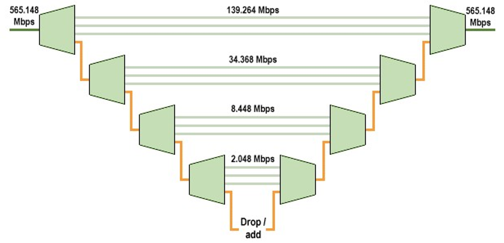

# PDH与SDH技术解析

## 1. PDH（准同步数字体系）

### 1.1 基本概念

PDH（Plesiochronous Digital Hierarchy）作为第一代光通信标准，通过规定速率等级和复用方法实现数字信号传输。其核心机制是通过不同容量的"次群"（一次群、二次群等）逐级复用信号。

#### 技术特征：

-   采用准同步机制：各节点使用独立时钟（精度±50ppm）
-   复用方式：逐级复用（低次群→高次群）
-   典型速率：
    -   欧洲标准：2M→8M→34M→140M→565M
    -   北美标准：1.5M→6.3M→45M→274M

### 1.2 复用原理



#### 关键机制：

```         
低速信号 → 码速调整 → 同步复接 → 高速信号
```

-   **码速调整**：通过插入填充字节解决时钟差异问题
-   4:1复用比例：4个低次群信号复用为1个高次群信号
-   速率非精确倍数：因开销字节增加导致的速率偏差（如4×8M=32M→实际34M）

### 1.3 主要缺陷

| 缺陷类型     | 具体表现                                             |
|--------------|------------------------------------------------------|
| 标准不统一   | 存在欧洲、北美、日本三大体系，设备互操作性差         |
| 复用效率低   | 需逐级解复用才能提取特定信号（类似"全车卸货找物品"） |
| 管理能力弱   | 仅0.1%的开销字节，无法支持完善的管理功能             |
| 时钟同步问题 | 累计时钟误差导致滑码、误码等传输问题                 |

## 2. SDH（同步数字体系）

### 2.1 技术革新

SDH（Synchronous Digital Hierarchy）通过全网同步时钟机制（精度±0.01ppm）实现更高效的传输体系。

#### 核心优势：

-   统一接口标准（ITU-T G.707）
-   直接分插复用能力（无需逐级解复用）
-   强大的管理功能（约5%的开销字节）

### 2.2 分层结构


#### 结构层级：

| 层级  | 名称         | 功能说明                          |
|-------|--------------|-----------------------------------|
| C     | 容器         | 适配不同速率信号（C-12/C-3/C-4）  |
| VC    | 虚容器       | 增加通道开销（POH）实现端到端监控 |
| TU    | 支路单元     | 通过TU PTR实现相位校准            |
| TUG   | 支路单元组   | 多TU信号的组合复用                |
| AU    | 管理单元     | 添加AU PTR实现高阶信号定位        |
| AUG   | 管理单元组   | 多AU信号的组合复用                |
| STM-N | 同步传输模块 | 基础传输单元（N=1/4/16/64/256）   |

### 2.3 复用流程

```         
PDH信号 → 映射 → 定位 → 复用 → STM-N
```

-   **映射**：将PDH信号装入对应容器（如2M→C-12）
-   **定位**：通过指针（PTR）实现相位校准
-   **复用**：同步字节间插复用保证时序完整性

## 3. PDH与SDH技术对比

| 对比维度     | PDH              | SDH                  |
|--------------|------------------|----------------------|
| 时钟同步     | 准同步（±50ppm） | 全同步（±0.01ppm）   |
| 复用方式     | 异步逐级复用     | 同步直接复用         |
| 标准统一性   | 多标准并存       | 国际统一标准         |
| 传输容量     | 最高565Mbps      | 最低155Mbps（STM-1） |
| 管理能力     | 0.1%开销字节     | 5%开销字节           |
| 运维成本     | 人工维护为主     | 智能网管系统         |
| 业务灵活性   | 固定速率适配     | VC虚级联动态调整     |
| 典型设备成本 | 较低             | 较高                 |

## 4. 技术演进启示

1.  **同步机制突破**：从准同步到全同步的时钟革命
2.  **管理能力提升**：从简单监控到完善的OAM功能
3.  **复用效率优化**：从逐级解复用到直接分插复用
4.  **标准统一进程**：区域标准→国际标准的演进路径
